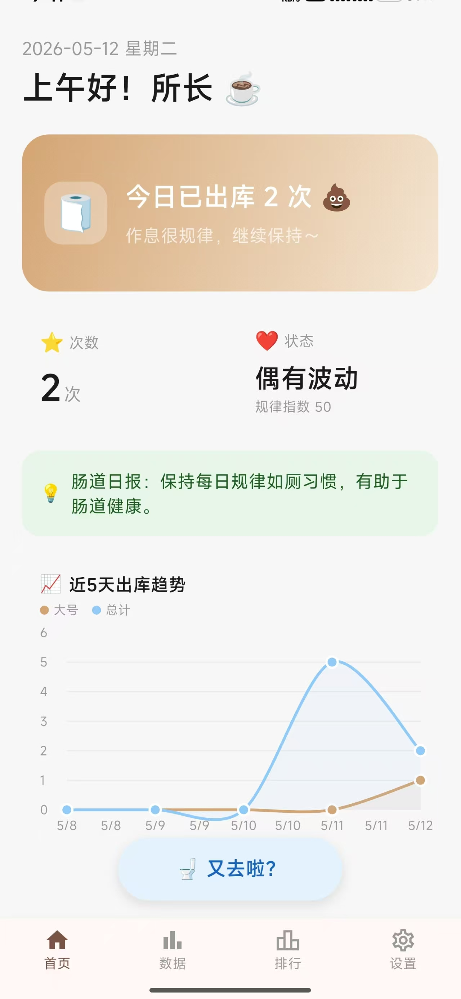

# 🚽 拉了么 (LaLeMe)

> 隐私优先的生理健康记录与轻社交排名应用

一个以隐私为核心、游戏化驱动的肠道健康管理应用。记录每一次「出库」，通过科学的六维积分体系、布里斯托分型、AI 智能分析等功能，帮助你建立规律如厕习惯。支持全球/同城/好友排行榜，在轻松氛围中关注健康。

---

## ✨ 核心特性

| 特性              | 说明                                                                      |
| ----------------- | ------------------------------------------------------------------------- |
| 🔒 **隐私优先**   | 所有原始数据默认仅存储在本地加密 SQLite，云端只同步脱敏后的积分与匿名排名 |
| 🔑 **用户主权**   | AI 大模型 API Key 由用户自行配置，客户端直调厂商 API，无中转泄露风险      |
| 🎮 **游戏化健康** | 六维积分体系(R/H/T/P/S/M)、7 级段位晋升、24 种成就解锁、月度赛季重置      |
| 📊 **多维统计**   | 周报/月报(日历热力图+健康等级)/年报(月度柱状图+年度关键词)                |
| 🤖 **AI 分析**    | 接入 LLM 大模型，分析如厕习惯给出个性化健康建议                           |
| 🏆 **排行榜**     | 全球榜/同城榜/好友榜/趣味榜，实时排名推送(WebSocket)                      |
| 🛡️ **反作弊**     | 客户端预检(频率/时长/间隔) + 服务端复检(Z-Score/乘数校验/地理跳跃)        |
| 🌙 **主题切换**   | Light / Dark / OLED 纯黑三套主题，跟随系统或手动选择                      |
| 🔔 **健康提醒**   | 便秘预警、腹泻预警、血便检测、晨便定时提醒                                |
| 🔐 **安全保护**   | 生物识别应用锁、隐私模式(最近任务隐藏)、AES 加密备份/恢复                 |

---



## 🏗️ 项目结构

```
WcRemark/
├── la-le-me-app/          # Flutter 客户端
│   ├── lib/
│   │   ├── main.dart             # 应用入口
│   │   ├── models/               # 数据模型 (记录/排名/成就/赛季/个人档案)
│   │   ├── providers/            # Riverpod 状态管理
│   │   ├── screens/              # 页面 (首页/统计/排行/设置/记录详情/...)
│   │   ├── services/             # 服务层 (DB/API/AI/反作弊/成就/赛季/加密/通知)
│   │   └── utils/                # 工具类
│   ├── android/                  # Android 原生
│   ├── ios/                      # iOS 原生
│   ├── web/                      # Web 端
│   └── pubspec.yaml              # 依赖配置
│
├── la-le-me-backend/      # Go 服务端
│   ├── cmd/server/               # 入口 main.go
│   ├── internal/
│   │   ├── config/               # 配置加载
│   │   ├── handler/              # HTTP/WS 处理器
│   │   ├── middleware/           # 中间件 (JWT/限流/CORS)
│   │   ├── model/                # 数据模型 & 自动迁移
│   │   ├── repository/           # 数据访问层 (PostgreSQL/Redis)
│   │   └── service/              # 业务逻辑 (排名/积分/反作弊/备份)
│   ├── config/config.yaml        # 配置文件
│   ├── docker/                   # Docker Compose & Dockerfile
│   └── Makefile                  # 构建命令
│
├── plan/                  # 设计文档 (14 份模块详细设计)
├── Skills/                # 开发工具 Skills
├── build_apk.sh            # 一键 APK 构建脚本
├── dist/                   # 构建产物目录
├── .gitignore
└── README.md
```

---

## 🚀 快速开始

### 环境要求

| 工具       | 版本   |
| ---------- | ------ |
| Flutter    | 3.38.5 |
| Go         | 1.23   |
| Java       | JDK 17 |
| PostgreSQL | >= 15  |
| Redis      | >= 7   |
| Docker     | 可选   |

### 1. 启动后端服务

```bash
cd la-le-me-backend

# 方式一：Docker Compose（推荐）
cd docker
docker-compose up -d

# 方式二：手动启动
# 1. 确保 PostgreSQL 和 Redis 已运行
# 2. 创建数据库
createdb la-le-me

# 3. 启动服务
go run cmd/server/main.go
```

服务默认监听 `http://localhost:8080`。

### 2. 启动 Flutter 客户端

```bash
cd la-le-me-app

# 配置 Android 本地属性（首次构建需要）
echo "sdk.dir=<你的Android SDK路径>" > android/local.properties
echo "flutter.sdk=<你的Flutter SDK路径>" >> android/local.properties

# 安装依赖
flutter pub get

# 一键构建（推荐）
./build_apk.sh

# 或手动构建
flutter build apk --release

# 输出路径: build/app/outputs/flutter-apk/app-release.apk

# 开发调试
flutter run

# Web 模式运行
flutter run -d chrome
```

### 3. Android 签名配置

项目已配置 `kaptree` 正式签名。密钥库路径：

- `android/app/kaptree.keystore`
- `android/key.properties`（凭据文件，已加入 `.gitignore`）

### 4. 一键构建脚本

项目根目录提供了 `build_apk.sh`，自动完成依赖安装、APK 构建与输出：

```bash
./build_apk.sh
```

脚本流程：
| 步骤 | 操作 |
|------|------|
| 1 | 自动设置 `ANDROID_HOME`、`JAVA_HOME`、Flutter 等环境变量 |
| 2 | `flutter pub get` 安装依赖 |
| 3 | `flutter build apk --release` 构建 Release APK |
| 4 | 复制 APK 到 `dist/la-le-me-app-release.apk` |

### 5. 配置 API 环境

客户端支持两种方式配置后端服务器：

**方式一：编译时环境变量（默认）**

| ENV          | 地址                             |
| ------------ | -------------------------------- |
| `dev` (默认) | `http://10.0.2.2:8080`           |
| `staging`    | `https://staging-api.laleme.app` |
| `prod`       | `https://api.laleme.app`         |

**方式二：应用内动态配置（推荐）**

在 设置 → 服务器配置 中手动填写服务器地址，支持：

- 🩺 **健康检查**：`GET /health` 实时检测服务器状态
- 🔗 **连接测试**：验证服务器可达性
- 💾 **持久化保存**：地址保存到本地数据库

```bash
# 方式一：编译时指定
flutter run -d chrome --dart-define=ENV=dev
flutter build apk --dart-define=ENV=prod

# 方式二：应用内动态配置（无需重新编译）
```

---

## 📱 功能导览

### 四大主 Tab

| Tab      | 图标 | 页面                                                              | 核心功能                                                                                  |
| -------- | ---- | ----------------------------------------------------------------- | ----------------------------------------------------------------------------------------- |
| **首页** | 🏠   | [home_page.dart](la-le-me-app/lib/screens/home_page.dart)         | 查看今日出库次数、快速记录(大号/小号)、周报摘要、每日健康提示                             |
| **数据** | 📊   | [stats_page.dart](la-le-me-app/lib/screens/stats_page.dart)       | 时间轴、成就殿堂、周报详情、月报(日历热力图+健康等级+布里斯托分布)、年报(月度趋势+关键词) |
| **排行** | 🏆   | [ranking_page.dart](la-le-me-app/lib/screens/ranking_page.dart)   | 全球榜/同城榜/好友榜 TabBar 切换                                                          |
| **设置** | ⚙️   | [settings_page.dart](la-le-me-app/lib/screens/settings_page.dart) | 个人档案、AI 配置、安全设置、数据管理、备份恢复、服务器配置                               |

### 记录流程

```
点击"🚽 又去啦？"
  → 选择记录类型 (小号/大号)
    → 反作弊预检
      → 积分计算 (六维乘数)
        → 赛季积分累加
          → 成就检查
            → 异常检测 (便秘/腹泻/血便)
```

### 积分体系

六维乘数体系 `R × H × T × P × S × M`：

| 因子 | 名称     | 说明                               |
| ---- | -------- | ---------------------------------- |
| R    | 规律系数 | 基于排便时间标准差计算，越规律越高 |
| H    | 健康系数 | 布里斯托 3-4 型加分，异常扣分      |
| T    | 时间系数 | 晨便(6-9点)加成、午便扣减          |
| P    | 付费系数 | 工作时间记录享受「带薪拉屎」加成   |
| S    | 赛季系数 | 赛季后半段衰减激励积极参与         |
| M    | 心情系数 | 心情越好积分越高                   |

**段位等级：**

| 段位     | 积分区间      | 图标 |
| -------- | ------------- | ---- |
| 初出茅庐 | 0 - 99        | 🥉   |
| 渐入佳境 | 100 - 499     | 🥈   |
| 规律达人 | 500 - 1999    | 🥇   |
| 肠道大师 | 2000 - 4999   | 💎   |
| 传奇所长 | 5000 - 9999   | 👑   |
| 史诗所长 | 10000 - 19999 | ⭐   |
| 神话所长 | 20000+        | 🏆   |

### 成就体系

24 项成就分为 5 大类别：

| 类别        | 数量 | 代表成就                                             |
| ----------- | ---- | ---------------------------------------------------- |
| 🏁 里程碑   | 5    | 初出茅庐、渐入佳境、百战老将、一年之约               |
| 📅 规律健康 | 5    | 晨便达人、一周规律、规律大师、生物钟活化石           |
| 🩺 健康指标 | 4    | 黄金便便、便便百科全书、模范肠道                     |
| 🎮 趣味挑战 | 8    | 带薪拉屎、摸鱼之神、闪电侠、双杀、夜猫子             |
| 🏆 积分段位 | 3    | 规律达人(500分)、肠道大师(2000分)、传奇所长(10000分) |

难度等级：⭐简单 / ⭐⭐中等 / ⭐⭐⭐困难 / 👑史诗

入口：数据 Tab → 🏆 成就殿堂

---

## 📡 API 概览

| 路由                       | 方法    | 说明                 | 鉴权  |
| -------------------------- | ------- | -------------------- | ----- |
| `/health`                  | GET     | 存活检查             | 无    |
| `/ready`                   | GET     | 就绪检查(含 DB 探活) | 无    |
| `/api/v1/auth/register`    | POST    | 用户注册             | 无    |
| `/api/v1/auth/login`       | POST    | 登录获取 JWT         | 无    |
| `/api/v1/auth/refresh`     | POST    | 刷新 Token           | JWT   |
| `/api/v1/user/profile`     | GET/PUT | 用户资料             | JWT   |
| `/api/v1/records/sync`     | POST    | 上传记录             | JWT   |
| `/api/v1/records/history`  | GET     | 查询历史             | JWT   |
| `/api/v1/rankings/global`  | GET     | 全球排行榜           | 限流  |
| `/api/v1/rankings/city`    | GET     | 同城排行榜           | 限流  |
| `/api/v1/rankings/friends` | GET     | 好友排行榜           | JWT   |
| `/api/v1/rankings/fun`     | GET     | 趣味排行榜           | 限流  |
| `/api/v1/backup/*`         | CRUD    | 备份管理             | JWT   |
| `/api/v1/ws/rankings`      | WS      | 实时排名推送         | Token |

---

## 🛠️ 技术栈

### 客户端

| 技术                   | 版本                 | 用途                 |
| ---------------------- | -------------------- | -------------------- |
| Flutter                | 3.38.5 (SDK >=3.3.0) | 跨平台 UI 框架       |
| Riverpod               | 2.6                  | 响应式状态管理       |
| sqflite                | 2.4                  | 本地 SQLite 数据库   |
| Dio                    | 5.9                  | HTTP 网络请求        |
| fl_chart               | 0.67                 | 原生图表渲染         |
| crypto / pointycastle  | 3.x                  | AES-256-GCM 加密     |
| local_auth             | 2.3                  | 生物识别 (指纹/面容) |
| flutter_secure_storage | 9.2                  | 安全 Key-Value 存储  |
| web_socket_channel     | 3.0                  | 实时排名推送         |

### 服务端

| 技术              | 版本               | 用途                  |
| ----------------- | ------------------ | --------------------- |
| Go                | 1.23 (工具链 1.24) | 后端语言              |
| Gin               | 1.9                | HTTP 框架             |
| GORM              | 1.25               | ORM (PostgreSQL)      |
| PostgreSQL        | 15                 | 主数据库              |
| Redis             | 7                  | 排行榜缓存 / 消息队列 |
| gorilla/websocket | 1.5                | WebSocket 实时推送    |
| golang-jwt        | 5.2                | JWT 鉴权              |
| Docker Compose    | -                  | 容器化部署            |

---

## 📚 文档索引

| 文档                                                                 | 说明                 |
| -------------------------------------------------------------------- | -------------------- |
| [plan/00-overview.md](plan/00-overview.md)                           | 总体计划与完成度总览 |
| [plan/01-home-record.md](plan/01-home-record.md)                     | 首页记录模块设计     |
| [plan/02-stats-analysis.md](plan/02-stats-analysis.md)               | 统计分析模块设计     |
| [plan/03-ai-analysis.md](plan/03-ai-analysis.md)                     | AI 分析模块设计      |
| [plan/04-ranking-score.md](plan/04-ranking-score.md)                 | 排名与积分模块设计   |
| [plan/05-settings-profile.md](plan/05-settings-profile.md)           | 设置与个人档案设计   |
| [plan/06-data-layer.md](plan/06-data-layer.md)                       | 数据持久化层设计     |
| [plan/07-backend-integration.md](plan/07-backend-integration.md)     | 后端 API 集成设计    |
| [plan/08-security-privacy.md](plan/08-security-privacy.md)           | 安全与隐私模块设计   |
| [plan/09-notification-reminder.md](plan/09-notification-reminder.md) | 通知提醒模块设计     |
| [plan/10-state-management.md](plan/10-state-management.md)           | 状态管理架构设计     |
| [plan/11-anti-cheat.md](plan/11-anti-cheat.md)                       | 反作弊系统设计       |
| [plan/12-achievement.md](plan/12-achievement.md)                     | 成就系统设计         |
| [plan/13-backup-restore.md](plan/13-backup-restore.md)               | 备份恢复模块设计     |
| [la-le-me-dev-docs.md](la-le-me-dev-docs.md)                         | 全栈开发文档         |

---

## 🧪 运行测试

```bash
# Flutter 静态分析
cd la-le-me-app && flutter analyze

# Flutter 单元测试
cd la-le-me-app && flutter test

# Go 后端测试
cd la-le-me-backend && go test ./...
```

---

## 📝 待办事项

- [ ] 云端数据同步
- [ ] 推送通知集成 (Firebase/APNs)
- [ ] E2E 测试覆盖
- [ ] iOS 真机构建与上架

---

## 📊 项目状态

| 版本   | 日期       | 状态                                                                                                       |
| ------ | ---------- | ---------------------------------------------------------------------------------------------------------- |
| v1.0.4 | 2026-05-12 | ✅ 安全设置(指纹应用锁+隐私模式)、时间轴模块、头像上传已完成 [GitHub](https://github.com/kaptree/WcRemark) |

---

## 📄 开源协议

MIT License

---

<p align="center">
  <sub>💩 每一次出库，都值得被记录 💩</sub>
</p>
